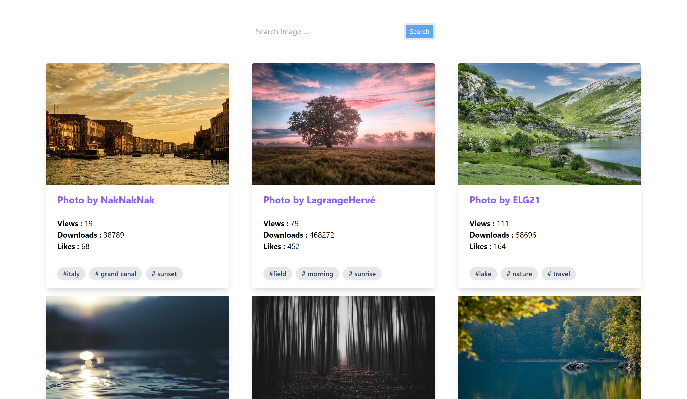

# Getting Started with Create React App

This project was bootstrapped with [Create React App](https://github.com/facebook/create-react-app).

This is a tutorial by Youtube Channel Traversy Media : (https://www.youtube.com/channel/UC29ju8bIPH5as8OGnQzwJyA),

This project is An Image gallery using PIXABAY API.

## What i have learned:
i learned How to setup a react project with Tailwind CSS, this is my first time using Tailwind css, fethcing data using Fetch API, manipulating the state, environment variables.

## what i have added : 
I added a button to load more images, and added some responsiveness.

